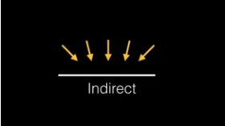
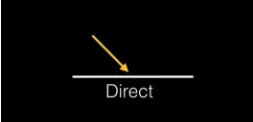

# 目标：掌握标准网络材质与光照物理效果
> 1.标准网络材质与光照物理效果
> 
> 2.置换贴图
> 
> 3.粗糙度与粗糙度贴图
> 
> 4.金属贴图
> 
> 5.法线贴图

# 1. 标准网络材质与光照物理效果
> 标准网络材质是根据[PBR物理渲染](https://zhuanlan.zhihu.com/p/342484575/)的
> 
> **太阳光源对地球来说是点光源制造阴影，然后加环境光决定场景亮度**

## 1.1 基础网格材质(MeshBasicMaterial) ---> 标准网格材质(MeshStandardMaterial)
```diff
- const basicMaterial = new THREE.MeshBasicMaterial({
+ const material = new THREE.MeshStandardMaterial({
```

## 1.2 追加灯光
### 1.21 [环境光](https://threejs.org/docs/index.html?q=light#api/zh/lights/AmbientLight/) 四面八方打过来的

> 环境光会均匀的照亮场景中的所有物体。
> 
> 环境光不能用来投射阴影，因为它没有方向
> 


```ts
const light = new THREE.AmbientLight(0x404040); // soft white light 柔和的白光
scene.add(light);
```

## 1.22 直线光 = [平行光](https://threejs.org/docs/index.html?q=light#api/zh/lights/DirectionalLight/)

> 平行光是沿着特定方向发射的光。
> 
> 这种光的表现像是无限远,从它发出的光线都是平行的。
> 
> 常常用平行光来模拟太阳光 的效果; 太阳足够远，因此我们可以认为太阳的位置是无限远，所以我们认为从太阳发出的光线也都是平行的。



```ts
// White directional light at half intensity shining from the top. 
// 白色的定向光在半强度从顶部照射
const directionalLight = new THREE.DirectionalLight(0xffffff, 0.5);
// 假如这个值设置等于 Object3D.DEFAULT_UP (0, 1, 0),那么光线将会从上往下照射+ (x，z, y)
directionalLight.position.set(10, 10, 10);
scene.add(directionalLight);
```

# 2.置换贴图 --- [位移贴图](https://threejs.org/docs/index.html?q=MeshStandardMaterial#api/zh/materials/MeshStandardMaterial.displacementMap)
> 位移贴图会影响网格顶点的位置,
> 
> 移位的顶点可以投射阴影，阻挡其他对象， 以及充当真实的几何体。

## 2.1 导入置换贴图
```ts
// 导入置换贴图
const doorHeightTexture = textureLoder.load('./textures/door/height.jpg')
```

## 2.2 使用置换贴图
```ts
const material = new THREE.MeshStandardMaterial({
  ...
  // 设置置换属性
  displacementMap: doorHeightTexture,
})
```

## 2.3 设置平面/物体的长宽分段 形成凹凸层次感
```diff
// 平面
- const planeGeometry = new THREE.PlaneGeometry(1, 1)
+ const planeGeometry = new THREE.PlaneGeometry(1, 1, 200, 200)

// 物体
- const cubeGeometry = new THREE.BoxGeometry(1, 1, 1)
+ const cubeGeometry = new THREE.BoxGeometry(1, 1, 1, 100, 100)
```

## 2.4 物体长宽分段导致过于突兀，设置 [displacementScale 对网格的影响程度](https://threejs.org/docs/index.html?q=MeshStandardMaterial#api/zh/materials/MeshStandardMaterial.displacementScale)
```diff
 const material = new THREE.MeshStandardMaterial({
   ...
   // 设置置换属性
   displacementMap: doorHeightTexture,
+  // 平面设置为200,200 宽度和高度分段太高导致很突兀，需要设置影响程度,这里最大凸出5公分
+  displacementScale: 0.05,
 })

```

# 3. [粗糙度](https://threejs.org/docs/index.html?q=MeshStandardMaterial#api/zh/materials/MeshStandardMaterial.roughness)与[粗糙度贴图](https://threejs.org/docs/index.html?q=MeshStandardMaterial#api/zh/materials/MeshStandardMaterial.roughnessMap)
> 改变物体粗糙度 
>
> 0.0表示平滑的镜面反射，1.0表示完全漫反射。默认值为1.0。

## 3.1 设置粗糙度为0 十分光滑
```ts
const material = new THREE.MeshStandardMaterial({
  ...
  roughness: 0,
})
```
> 但是门框的金属粗糙度没有体现出来 所以需要使用 `roughnessMap`
## 3.2 导入粗糙度贴图
```ts
const doorRoughnessTexture = textureLoder.load('./textures/door/roughness.jpg')
```
## 3.3 设置门框粗糙度属性
```diff
 const material = new THREE.MeshStandardMaterial({
   ...
   roughness: 0,
+  roughnessMap: doorRoughnessTexture,
 })
```

# 4.[金属贴图](https://threejs.org/docs/index.html?q=MeshStandardMaterial#api/zh/materials/MeshStandardMaterial.metalness)
> 改变门框的金属的质感
>
> 改变物体金属度  --- 材质与金属的相似度。
>
> 非金属材质，如木材或石材，使用0.0，金属使用1.0，**通常没有中间值**。
>
> **默认值为0.0。0.0到1.0之间的值可用于生锈金属的外观。**

## 3.1 设置设置金属度为1 为纯金属
```ts
const material = new THREE.MeshStandardMaterial({
  ...
  metalness: 1,
})
```

## 4.2 导入金属贴图
```ts
const doorMetalnessTexture = textureLoder.load('./textures/door/metalness.jpg')
```

## 4.3 设置金属度属性
```diff
 const material = new THREE.MeshStandardMaterial({
   ...
   metalness: 1,
+  metalnessMap: doorMetalnessTexture,
 })
```

# 5. 法线贴图
> RGB值会影响每个像素片段的曲面法线，并更改颜色照亮的方式。
>
> 法线贴图不会改变曲面的实际形状，只会改变光照。
>
>
> 怎么反射这个光，增加凹凸感
## 5.1 导入法线贴图
```ts
const doorNormalTexture = textureLoder.load('./textures/door/normal.jpg')
```

## 5.2 设置法线属性
```ts
const material = new THREE.MeshStandardMaterial({
  ...
  normalMap: doorNormalTexture,
})
```
