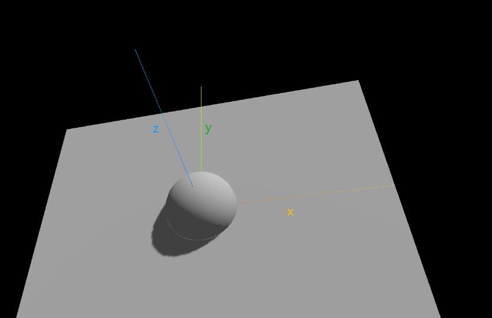
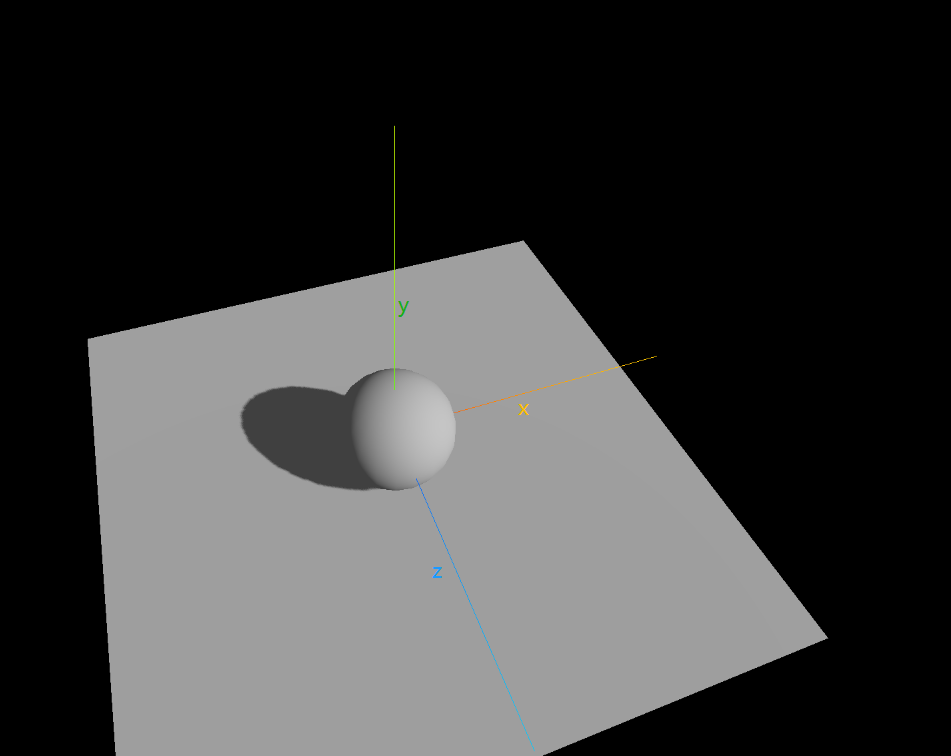

# 目的：灯光与阴影
# 1. 材质要满足能够对光照有反应
> 添加物理和平面以及灯光
> 但是记住平面要旋转
> **旋转前**

```ts
// 旋转后 轴变了
plane.rotation.x = -Math.PI / 2
```
> **旋转后**


# 2. 设置[渲染器开启阴影](https://threejs.org/docs/index.html?q=DirectionalLight#api/zh/renderers/WebGLRenderer.shadowMap)的计算 
```diff
  const renderer = new THREE.WebGLRenderer()
  renderer.setSize(window.innerWidth, window.innerHeight)
  // 2. 开启场景中的阴影贴图
+ renderer.shadowMap.enabled = true
```
# 3. 设置[光照投影阴影](https://threejs.org/docs/index.html?q=DirectionalLight#api/zh/lights/DirectionalLight.castShadow)
```diff
  const light = new THREE.AmbientLight(0x404040); // soft white light 柔和的白光
  scene.add(light);
  // 直线光 = 平行光
  // White directional light at half intensity shining from the top. 
  // 白色的定向光在半强度从顶部照射
  const directionalLight = new THREE.DirectionalLight(0xffffff, 0.5);
  // 假如这个值设置等于 Object3D.DEFAULT_UP (0, 1, 0),那么光线将会从上往下照射+ (x，z, y)
  directionalLight.position.set(10, 10, 10);
  // 3. 设置光照投影阴影
+ directionalLight.castShadow = true
  scene.add(directionalLight);
```
# 4. 设置[物体投射阴影](https://threejs.org/docs/index.html?q=Mesh#api/zh/core/Object3D.castShadow)
```diff
  // 添加物体 -- 球
  const sphereGeometry = new THREE.SphereGeometry(1, 20, 20)
  // 材质
  const material = new THREE.MeshStandardMaterial()
  // 合成球体
  const sphere = new THREE.Mesh(sphereGeometry, material);
  // 4.设置物体投射阴影
+ sphere.castShadow = true
  scene.add(sphere);
```
# 5. 设置[物体接受阴影](https://threejs.org/docs/index.html?q=Mesh#api/zh/core/Object3D.receiveShadow)
```diff
  // 创建一个平面
  const planeGeometry = new THREE.PlaneGeometry(10, 10)
  const plane = new THREE.Mesh(planeGeometry, material)
  plane.position.set(0, -1, 0)
  // 旋转后 轴变了
  plane.rotation.x = -Math.PI / 2
  // 5. 设置物体接受阴影
+ plane.receiveShadow = true
  scene.add(plane)
```


