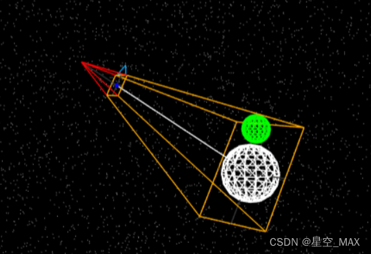
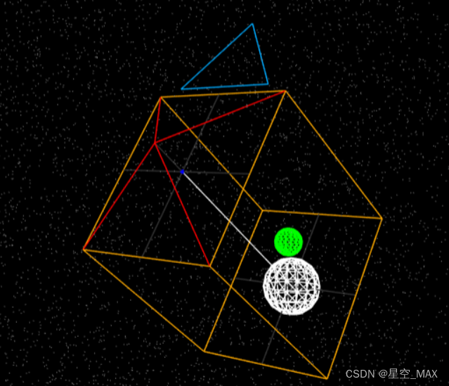

# 目标：平行光阴影属性与阴影相机原理
# 1. 设置[阴影模糊度](https://threejs.org/docs/index.html#api/zh/lights/shadows/LightShadow.radius)
```ts
directionalLight.shadow.radius = 20
```
> 但是看起来很模糊，所以需要调节一下分辨率
# 2. 设置[阴影贴图的分辨率](https://threejs.org/docs/index.html#api/zh/lights/shadows/LightShadow.mapSize)
> 值必须是2的幂，直到给定设备的  认值为*（512,512）*
```ts
directionalLight.shadow.mapSize.set(4096, 4096)
```
# 3.设置平行光投射相机的属性([正交相机](https://threejs.org/docs/index.html#api/zh/cameras/OrthographicCamera))
```ts
directionalLight.shadow.camera.near = 0.5
directionalLight.shadow.camera.far = 500
directionalLight.shadow.camera.top = 5
directionalLight.shadow.camera.bottom = -5
directionalLight.shadow.camera.left = -5
directionalLight.shadow.camera.right = 5
```

## 3.1 正交相机---[近大远小，是个锥形]

## 3.2 [透视摄像机](https://threejs.org/docs/index.html#api/zh/cameras/PerspectiveCamera) ----[同等大小，是个长方体]


# 4. gui控制一下相机投影点
```ts
// 创建gui
const gui = new dat.GUI();
gui
  .add(directionalLight.shadow.camera, 'near')
  .min(10)
  .max(20)
  .step(0.1)
  .onChange(() => {
    // 更新摄像机的投影矩阵
    directionalLight.shadow.camera.updateProjectionMatrix()
  })
```